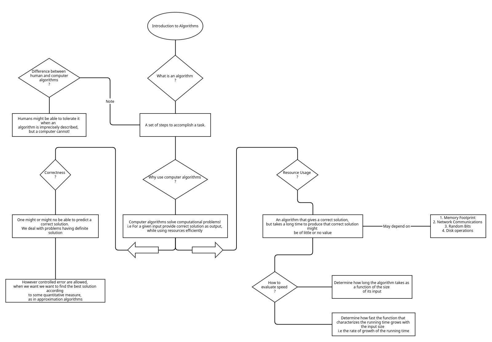

# Straight from the book
>What is an algorithm?   
A broad answer would be “a set of steps to accomplish a task.”

>You might be able to tolerate it when an algorithm is imprecisely described, but a computer cannot. 

>In this book, we will focus on computer algorithms
that have knowable solutions.

>Correctness is a tricky issue with another class of algorithms, called
approximation algorithms. Approximation algorithms apply to opti-
mization problems, in which we want to find the best solution according
to some quantitative measure.

>An algorithm that gives a correct
solution but takes a long time to produce that correct solution might
be of little or no value.

>How, then, can
we evaluate an algorithm’s speed?  
The answer is that we do so by a combination of two ideas. First,
we determine how long the algorithm takes as a function of the size
of its input.  
Second, we focus on how fast the function that characterizes the run-
ning time grows with the input size—the rate of growth of the running
time

>In practice, the coefficients that we ignore do matter. But they de-
pend so heavily on the extrinsic factors that it’s entirely possible that if
we were comparing two algorithms, A and B, that have the same order
of growth and are run on the same input, then A might run faster than B
with a particular combination of machine, programming language, com-
piler/interpreter, and programmer, while B runs faster than A with some
other combination

# Mind Map

# Verdict 
Some algorithms are better than others  
e.g: nlgn > n^2

